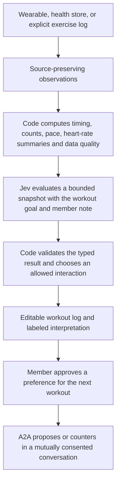

# Jev for SamePace fitness tracking

Status: implementation design, researched September 20, 2026. The TypeSafe skill is installed for Codex in this repository. No TypeSafe runtime SDK, inference calls, wearable integration, or health-data collection has been added by this change. Continue on `codex/samepace-fixes-a2a`.

## Product direction

Make the workout log understand what the member is doing with less manual entry. Jev evaluates a small, current description of the workout and returns decisions that SamePace can use immediately. The first benefit should be better exercise logging and interpretation; matching can use the resulting member-approved preferences later.

The recommended sequence is **real workout import plus an editable interpretation**, followed by **live capture and occasional contextual decisions**. A member can start with explicit workout logging while the selected wearable adapter is built. Device priority remains open: Apple Watch/iPhone, Android/Wear OS, or phone logging first.

## Current repository gap

| Existing surface | What it currently does |
| --- | --- |
| `src/routes/health.tsx` | Shows the web prototype's local health store. |
| `src/lib/seed.ts` | Supplies demo heart rate, HRV, recovery, sleep, and workouts. |
| `src/lib/store.ts` → `connectHealth` | Toggles a local boolean; it does not authorize HealthKit. |
| `src/lib/store.ts` → `addPaceWorkout` | Uses a fixed average heart rate of 138 and duration-based calorie/distance formulas. It does not write to Apple Health. |
| Mobile Live Session | Uses foreground location to confirm arrival. It is not a workout recorder. |
| Mobile Activity and rings | Show notifications and attendance/reputation, respectively. |

There are no HealthKit, Health Connect, heart-rate sensor, or watch-workout integrations in the current mobile configuration. Replace or explicitly label prototype health claims before exposing a real tracking feature. Never import these synthetic records into a member's real health history.

A completed social booking means both people checked in. It does not establish that they exercised for the scheduled duration. Introduce a separate private workout record, optionally linked to the social booking.

## The three layers

Observed facts retain their source, timestamps, units, availability, and revision. Derived metrics identify the calculation that produced them. Jev interpretations identify their model, question version, input revision, probability distribution, and any later user correction. An interpretation never overwrites the measurement it describes.

## Where Jev adds value

| Feature | Typed judgment | Product behavior |
| --- | --- | --- |
| Fast exercise logging | `Choice` selects the intended exercise and the roles of numeric spans from a member's note, with `not_stated` / `none_of_these` outcomes. | “Three sets of eight bench at 135 pounds” fills a draft from verbatim values; code validates units and computes volume. |
| Ambiguous workout segments | `Choice` identifies which supplied planned segment best describes a bounded observation window: warm-up, work, recovery, cooldown, or unclear. | Suggest a segment label when the recorder does not already know it. Preserve a timer's or member's explicit segment label. |
| Plan interpretation | A narrow `Choice` or `Score` compares the member's stated goal with a summary and optional note. | Distinguish a deliberate change (“finished early for a meeting”) from an unexplained deviation; retain uncertainty. |
| Useful logging prompts | `Choice` selects a known prompt category from the actual ambiguity, including `no_prompt`. | Ask “Was that a rest or the end of the workout?” sparingly; code chooses the copy and enforces a cooldown. |
| Next-workout suggestions | Comparable `Score` questions rank already-valid candidate plans against explicit preferences. | A member approves “short, conversational run today”; their agent negotiates within those preferences. |

The first three are hypotheses to evaluate on actual workout examples. Heart rate alone does not establish an exercise identity, set count, or reason for a change. Phase interpretation needs supporting plan, motion/source labels, timing, or member input. Jev cannot read video or audio directly; transcription or a separate sensor/vision pipeline would produce its inputs.

TypeSafe provides [Choice](https://docs.typesafe.ai/primitives/choice), [Score](https://docs.typesafe.ai/primitives/score), and [Noul](https://docs.typesafe.ai/primitives/noul). Use a Choice for a category, a Score for a graded semantic dimension, and a Noul for a single yes/no condition. A score is not a measured quantity or a probability that a person is physiologically ready. [Confidence](https://docs.typesafe.ai/confidence) describes the model's answer distribution, not guaranteed correctness.

## Heart-rate handling

The source supplies BPM samples. Code computes valid sample coverage, freshness, min/max, an explicitly defined average, and comparisons against any user- or source-defined workout targets. Do not infer missing samples or turn a model score into BPM, calories, repetitions, HRV, or a recovery percentage.

Only send Jev the summary needed for the semantic question. Examples of code-derived facts are `heartRateAvailability: "stale"`, `paceComparedWithPlan: "slower"`, and `elapsedInSegmentSeconds`. Keep absence distinct from a low value. Avoid inferring causes such as illness, dehydration, or cardiac events; this design is for fitness logging and contextual interpretation.

Use event-triggered evaluation after a new note, an ambiguous segment transition, or a meaningful change in a summarized window. Do not make a cloud request for each heartbeat. Keep recording and displaying measurements offline or during inference failure. Measure end-to-end latency, battery impact, and useful decisions per request before selecting a live cadence.

This separation follows TypeSafe's own [Jev 1.13 limitations](https://docs.typesafe.ai/model-jaggedness/jev-1.13): numeric precision, counting, arithmetic, and date/time comparisons belong in code; narrow semantic judgments are the intended use.

## Real data sources

| Platform | First integration | Live integration |
| --- | --- | --- |
| Apple | Read saved workouts and associated metrics using HealthKit. Apply additions/deletions with a saved query anchor. | A native Apple Watch workout uses `HKWorkoutSession` and `HKLiveWorkoutBuilder`, with mirroring to iPhone. iPhone workout sessions require an external sensor for live heart rate. |
| Android | Import exercise sessions and associated heart-rate records through Health Connect, using source IDs and incremental changes. | A native Wear OS app uses Health Services `ExerciseClient`; check supported data types and persist its session state. |
| Phone-only logging | Explicit exercise, sets, repetitions, weights, and notes; optional measured location for supported activities. | No heart-rate measurement without a suitable source. Missing heart rate remains unavailable. |

Health-store synchronization and observer callbacks are not guaranteed live sensor streams. SamePace already uses an Expo development client, so a native bridge or local Expo module is compatible with its architecture, but permissions, native builds, watch targets, and physical-device verification are still required. Sources: [Apple workout architecture](https://developer.apple.com/videos/play/wwdc2025/322/), [Apple observer queries](https://developer.apple.com/documentation/healthkit/executing-observer-queries), [Health Connect workouts](https://developer.android.com/health-and-fitness/health-connect/experiences/workouts), [Wear OS active exercise data](https://developer.android.com/health-and-fitness/health-services/active-data), [Expo native code](https://docs.expo.dev/workflow/customizing/).

## First implementation boundary

Proposed modules, not files already implemented:

| Module | Responsibility |
| --- | --- |
| `mobile/src/lib/workouts/` | Source adapters, device permissions, import cursor, recording lifecycle, and local persistence. |
| `src/lib/workouts/contracts.ts` | Workout record, measurement provenance, explicit user goal, bounded snapshot, and assessment result. |
| `src/lib/workouts/summary.ts` | Pure, tested calculations; missing/stale data behavior; duplicate and out-of-order sample handling. |
| `src/lib/workouts/questions.ts` | Versioned TypeSafe questions with explicit unknown/none outcomes and concrete criteria. |
| `src/lib/workouts/assessment.server.ts` | Server-only TypeSafe adapter; input allowlist, limits, timeout, validated answers, and fallback. No booking permissions. |
| Private workout API and screen | Owner-only records, deletions/corrections, measured facts, and clearly labeled interpretations. Separate from arrival verification. |

Use the existing authenticated API transport, but place health authorization and data access in a separate workout domain. A source record needs at least `source`, `externalId`, `sourceRevision`, start/end timestamps, activity, and provenance for each optional metric. Deduplicate imports by source identity; process source deletions rather than reintroducing them from an older cache.

The assessment result should include `workoutId`, `snapshotRevision`, `questionVersion`, `model`, `assessedAt`, typed answers, and an explicit `available | insufficient_data | provider_unavailable` outcome. Reject a result if the recording or user correction has advanced its source revision. Never apply a result from a different workout or member.

Use `@typesafe-ai/sdk` on the server, with `TypeSafeClient.systemOne({ state, questions, model })`; the [JavaScript SDK](https://docs.typesafe.ai/sdk/javascript) reads `TYPESAFE_API_KEY`. Pin an evaluated model version and record the actual returned model. The documentation currently lists `jev-1.13.0`; recheck before implementation. Set an explicit latency/retry budget, disable body logging, and batch independent questions against the same compact state. No live model accuracy or latency has been measured for SamePace yet.

Start with synthetic and explicitly contributed examples, then evaluate real, authorized records before enabling user-facing inference. Device permissions, sending selected data to TypeSafe, and sharing preferences with another member are separate user choices. A2A consent alone does not authorize exporting health history.

## Joining this to A2A

The implemented A2A service currently negotiates `WorkoutPlan` objects for two members who completed a shared booking and both opted in. Keep that contract narrow. Raw heart rate, HRV, sleep, and workout history do not enter negotiation messages.

The bridge is a member-approved preference such as “I want a short easy walk this evening.” Each assistant can evaluate candidate plans privately, then send a normal `propose` command with the current `expectedRevision`. Existing code still validates venue, time, ability shape, consent, and credentials. Both members approve the same final revision; approval currently creates no booking. Broader first-time matching is separate work.

## Validation before rollout

1. Prove that actual imported facts survive permission changes, duplication, out-of-order updates, source corrections, and deletion. Test native behavior on the selected device.
2. Build labeled examples for exercise names, units, missing fields, ambiguous rest periods, contradictory notes, stale sensors, and instructions embedded in user text. Separate extraction mistakes from missing evidence and calculation errors.
3. Compare model-assisted drafts with manual logging: correction rate, useful prompt rate, missed/false segment labels, and completion time. Evaluate confidence thresholds per judgment; include an abstention path.
4. Measure p50/p95/p99 latency, inference failures, retries, request cost, battery use, and behavior when offline. Fast model inference is only one part of the loop.
5. Verify that no assessment can authenticate an agent, disclose another member's health data, confirm a proposal, change a booking, or create a fee.

The initial success criterion is a more accurate, easier-to-correct workout log with real measurements. Automatic medical conclusions, camera-based form assessment, and inferred rep counts are outside this first design.
