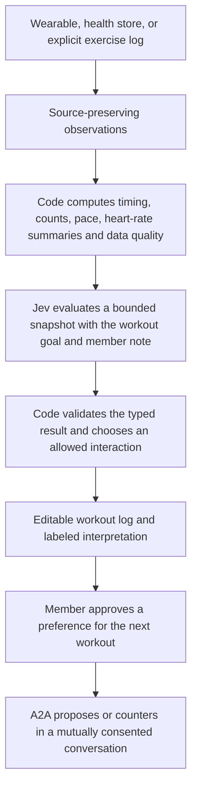

# Jev for SamePace fitness tracking

Status: server integration and editable logging implemented September 21, 2026; a small synthetic live evaluation is complete; member-cohort validation and physical-device acceptance remain pending. The project TypeSafe skill was used, including the current HTTP API, Choice, confidence, models, and pre-parsed value extraction cookbook. [Apple Health import](./APPLE-HEALTH.md) supplies real source records; private manual logs and correction overlays are separate. Inference is off unless `JEV_ENABLED=true` and a server-side `TYPESAFE_API_KEY` are configured, and each member separately opts in. Track delivery in the [vision roadmap](./VISION-ROADMAP.md).

## Product direction

Make the workout log understand what the member is doing with less manual entry. Jev evaluates a small, current description of the workout and returns decisions that SamePace can use immediately. The first benefit should be better exercise logging and interpretation; matching can use the resulting member-approved preferences later.

The agreed first source is **Apple Health sync**: import real workouts and associated heart rate, then add the other authorized variables needed by a feature. Resting heart rate, HRV, sleep, steps, distance, and active energy are optional context when available. Keep each variable's source, units, time range, and missing-data state explicit; a daily total must not be presented as a workout measurement.

The recommended sequence is **real workout import plus an editable interpretation**, followed by contextual suggestions based on useful changes in synced data. Explicit exercise logging fills details the source does not provide. A custom live recorder and Android support are later extensions; Apple Health synchronization does not guarantee an immediate heartbeat stream.

## Separate prototype surfaces

| Existing surface                      | What it currently does                                                                                                  |
| ------------------------------------- | ----------------------------------------------------------------------------------------------------------------------- |
| `src/routes/health.tsx`               | Shows the web prototype's local health store.                                                                           |
| `src/lib/seed.ts`                     | Supplies demo heart rate, HRV, recovery, sleep, and workouts.                                                           |
| `src/lib/store.ts` → `connectHealth`  | Toggles a local boolean; it does not authorize HealthKit.                                                               |
| `src/lib/store.ts` → `addPaceWorkout` | Uses a fixed average heart rate of 138 and duration-based calorie/distance formulas. It does not write to Apple Health. |
| Mobile Live Session                   | Uses foreground location to confirm arrival. It is not a workout recorder.                                              |
| Mobile Activity and rings             | Show notifications and attendance/reputation, respectively.                                                             |

The native HealthKit reader, private API, and mobile `/health` screen import real source records when explicitly enabled and connected. The web prototype above is separate and visibly labels its readings and workouts as simulated; never import those synthetic records into real history. Health Connect, live sensors, and a watch recorder remain future scope choices.

A completed social booking means both people checked in. It does not establish that they exercised for the scheduled duration. Private imported workouts now live in a separate domain; optional links to social bookings remain future work.

## The three layers

This diagram describes the intended separation of responsibilities, including future preference suggestions; it is not a claim that sensor-based interpretation or a fitness-to-agent bridge is implemented. Observed facts retain their source, timestamps, units, availability, and revision. Derived metrics identify the calculation that produced them. Available Jev interpretations identify their model, question version, input revision and probability distribution. An interpretation never overwrites the measurement it describes. Exercise edits and optional pilot comparisons are separate from saved workout-note interpretations.

## Where Jev adds value

| Feature                    | Typed judgment                                                                                                                                 | Product behavior                                                                                                           |
| -------------------------- | ---------------------------------------------------------------------------------------------------------------------------------------------- | -------------------------------------------------------------------------------------------------------------------------- |
| Fast exercise logging      | `Choice` selects the intended exercise and the roles of numeric spans from a member's note, with `not_stated` / `none_of_these` outcomes.      | “Three sets of eight bench at 135 pounds” fills a draft from verbatim values; code validates units and computes volume.    |
| Ambiguous workout segments | `Choice` identifies which supplied planned segment best describes a bounded observation window: warm-up, work, recovery, cooldown, or unclear. | Suggest a segment label when the recorder does not already know it. Preserve a timer's or member's explicit segment label. |
| Plan interpretation        | A narrow `Choice` or `Score` compares the member's stated goal with a summary and optional note.                                               | Distinguish a deliberate change (“finished early for a meeting”) from an unexplained deviation; retain uncertainty.        |
| Useful logging prompts     | `Choice` selects a known prompt category from the actual ambiguity, including `no_prompt`.                                                     | Ask “Was that a rest or the end of the workout?” sparingly; code chooses the copy and enforces a cooldown.                 |
| Next-workout suggestions   | Comparable `Score` questions rank already-valid candidate plans against explicit preferences.                                                  | A member approves “short, conversational run today”; their agent negotiates within those preferences.                      |

Fast exercise drafts and the narrow note-versus-goal interpretation are implemented and need representative member evaluation. Segment labels, contextual logging prompts and semantic ranking of next-workout plans remain proposed features. Heart rate alone does not establish an exercise identity, set count, or reason for a change. Phase interpretation needs supporting plan, motion/source labels, timing, or member input. Jev cannot read video or audio directly; transcription or a separate sensor/vision pipeline would produce its inputs.

TypeSafe provides [Choice](https://docs.typesafe.ai/primitives/choice), [Score](https://docs.typesafe.ai/primitives/score), and [Noul](https://docs.typesafe.ai/primitives/noul). Use a Choice for a category, a Score for a graded semantic dimension, and a Noul for a single yes/no condition. A score is not a measured quantity or a probability that a person is physiologically ready. [Confidence](https://docs.typesafe.ai/confidence) describes the model's answer distribution, not guaranteed correctness.

## Heart-rate handling

The source supplies BPM samples. Code computes valid sample coverage, freshness, min/max, an explicitly defined average, and comparisons against any user- or source-defined workout targets. Do not infer missing samples or turn a model score into BPM, calories, repetitions, HRV, or a recovery percentage.

Only send Jev the summary needed for the semantic question. Examples of code-derived facts are `heartRateAvailability: "stale"`, `paceComparedWithPlan: "slower"`, and `elapsedInSegmentSeconds`. Keep absence distinct from a low value. Avoid inferring causes such as illness, dehydration, or cardiac events; this design is for fitness logging and contextual interpretation.

Use event-triggered evaluation after a new note, an ambiguous segment transition, or a meaningful change in a summarized window. Do not make a cloud request for each heartbeat. Keep recording and displaying measurements offline or during inference failure. Measure end-to-end latency, battery impact, and useful decisions per request before selecting a live cadence.

This separation follows TypeSafe's own [Jev 1.13 limitations](https://docs.typesafe.ai/model-jaggedness/jev-1.13): numeric precision, counting, arithmetic, and date/time comparisons belong in code; narrow semantic judgments are the intended use.

## Real data sources

| Platform               | First integration                                                                                                                                                                 | Live integration                                                                                                                                                                            |
| ---------------------- | --------------------------------------------------------------------------------------------------------------------------------------------------------------------------------- | ------------------------------------------------------------------------------------------------------------------------------------------------------------------------------------------- |
| Apple — selected first | Read saved workouts and associated metrics using HealthKit. Apply additions/deletions with a saved query anchor. Request other health variables only for features that need them. | A later native Apple Watch workout can use `HKWorkoutSession` and `HKLiveWorkoutBuilder`, with mirroring to iPhone. iPhone workout sessions require an external sensor for live heart rate. |
| Android — later        | Import exercise sessions and associated heart-rate records through Health Connect, using source IDs and incremental changes.                                                      | A native Wear OS app uses Health Services `ExerciseClient`; check supported data types and persist its session state.                                                                       |
| Phone-only logging     | Explicit exercise, sets, repetitions, weights, and notes; optional measured location for supported activities.                                                                    | No heart-rate measurement without a suitable source. Missing heart rate remains unavailable.                                                                                                |

Health-store synchronization and observer callbacks are not guaranteed live sensor streams. SamePace already uses an Expo development client, so a native bridge or local Expo module is compatible with its architecture, but permissions, native builds, watch targets, and physical-device verification are still required. Sources: [Apple workout architecture](https://developer.apple.com/videos/play/wwdc2025/322/), [Apple observer queries](https://developer.apple.com/documentation/healthkit/executing-observer-queries), [Health Connect workouts](https://developer.android.com/health-and-fitness/health-connect/experiences/workouts), [Wear OS active exercise data](https://developer.android.com/health-and-fitness/health-services/active-data), [Expo native code](https://docs.expo.dev/workflow/customizing/).

## First implementation boundary

The import and first inference layers now exist:

| Module                                                                         | Responsibility                                                                                                                                                                                                                                      |
| ------------------------------------------------------------------------------ | --------------------------------------------------------------------------------------------------------------------------------------------------------------------------------------------------------------------------------------------------- |
| `mobile/modules/samepace-healthkit` and `mobile/src/lib/health/` — implemented | Native source reader, explicit permissions, manual sync lifecycle, and account-bound transport. Anchors persist on the server; raw health records are not stored locally.                                                                           |
| `shared/health.ts` and `src/lib/health/contracts.ts` — implemented             | Source records, units, provenance, connection generation, and strict import contracts. Private manual logs, corrections, consent, drafts, and assessment contracts are in `shared/fitness.ts`.                                                      |
| `src/lib/health/summary.ts` — implemented                                      | Tested elapsed time, source active-duration pace, and source-bound heart-rate sample statistics.                                                                                                                                                    |
| `src/lib/fitness/questions.ts`                                                 | Versioned TypeSafe Choice questions, source-span number candidates, a closed exercise catalogue, explicit unknown outcomes, and conservative editable-draft composition.                                                                            |
| `src/lib/fitness/typesafe.server.ts` and `service.server.ts`                   | Server-only HTTP adapter, private persistence, distinct consent, bounded input, five-second timeout, strict response validation, freshness checks, and manual fallback. No booking permissions.                                                     |
| Private fitness API and mobile screen                                          | Owner-only manual strength logs, explicit editable AI drafts, correction overlays that survive source resync, paginated fitness export, and labeled note-versus-goal interpretation. The mobile release combines these with health sync and export. |

Use the existing authenticated API transport, but place health authorization and data access in a separate workout domain. A source record needs at least `source`, `externalId`, `sourceRevision`, start/end timestamps, activity, and provenance for each optional metric. Deduplicate imports by source identity; process source deletions rather than reintroducing them from an older cache.

The assessment result includes `workoutId`, `snapshotRevision` and an explicit `available | insufficient_data | provider_unavailable` status. Available results include nested metadata with `questionVersion`, `model`, `assessedAt` and typed answers. Code fingerprints the entire authorized input snapshot, including readings, freshness, and connection/consent generation. The workout `revision` covers only its source object: late heart-rate samples or removed permissions can change a summary independently. Results are rejected after a relevant snapshot change or when the workout/member no longer matches.

The server uses the documented [HTTP API](https://docs.typesafe.ai/api) directly instead of adding an SDK dependency. It sends `POST https://api.typesafe.ai/v1/systemone` with `state`, `questions`, and the pinned model `jev-1.13.0`; the server alone reads `TYPESAFE_API_KEY`. Current model documentation was checked during implementation. This model is pinned for reproducibility, **evaluated only on the small synthetic examples below, not member health data**. An answer must report that exact model, every requested question and option, finite probabilities summing to one, the highest-probability selected option, and valid token counts. Unexpected schemas fail closed. A five-second total deadline, no automatic retries, 24 KB request cap, 64 KB response cap, three-second member cooldown, and 60 requests per member per UTC day bound usage. Requests and provider errors are never logged; operational logs contain only question version, model, success/unavailable status, elapsed milliseconds, and input/output token counts. Cost is not estimated from unverified prices. Observed synthetic latency and draft results are recorded below; these do not establish member-cohort accuracy or production latency.

Start with synthetic and explicitly contributed examples, then evaluate real, authorized records through an optional editable pilot before wider rollout. Device permissions, sending selected data to TypeSafe, and sharing preferences with another member are separate user choices. A2A consent alone does not authorize exporting health history.

## Implemented behavior and privacy

`POST /api/v1/fitness/draft` takes one member-submitted note of at most 1,000 characters. Code finds numeric source spans (including supported English number words) and explicitly written units. Jev selects from those candidates and the exercise catalogue; it cannot supply a new number. Unsupported or conflicting values stay missing. The provisional 0.75 probability and concentration floors only decide whether to show an editable suggestion; they are not an accuracy claim. Different set schemes and multiple exercises require manual entry when they cannot be expressed as one uniform draft. A separate `log_scope` judgment now requires a sufficiently clear single actual exercise log before any field is suggested; multiple exercises, output instructions, and unclear notes produce a whole-draft abstention. The draft does not create a log. The member edits it and uses the ordinary save action.

Manual strength logs are available without HealthKit or Jev. They contain member-entered time, exercise, notes, and individual sets. Code counts repetitions and normalizes explicitly known external load to kilograms. Unknown load and bodyweight retain `totalVolumeKg: null`. No calories, heartbeat, energy, distance, or body mass are fabricated. Updates use revisions to avoid overwriting a newer edit.

Imported-workout corrections are overlays: title, activity label, and note. A resync can change the source record while retaining this member-authored overlay. Source or member deletion removes the overlay and any saved interpretation; disconnect removes imported-workout overlays through source foreign keys. Independent manual logs survive a HealthKit disconnect. Account deletion cascades all private fitness tables.

Workout assessment only interprets an explicit note relative to an explicit member goal: following the goal, a deliberate change, or unclear. It never labels a physiological state or infers the reason for a deviation from heart rate. The provider receives only that note, goal, selected source/member activity label, source duration, and source distance. It receives no identity, device or workout ID, timestamps, raw heart-rate samples, sleep, HRV, daily metrics, or other history. A useful note, current HealthKit connection, and sync within the past seven days are required. The full authorized local snapshot is fingerprinted before and after inference, including member, consent generation, connection/cursors, source workout and summary, correction revision, requested goal/note, and question version. Late samples, edits, disconnect, or permission changes invalidate the result. Saved results are rechecked before retrieval/export.

`PUT /api/v1/fitness/consent` records a separate generation and notice version. Revocation removes saved interpretations and invalidates in-flight replies; it does not erase the member's own logs or correction notes. The consent notice lists the data sent and makes clear that accepting a draft and sharing a preference are separate choices. A2A scope never grants access to these endpoints.

## Evaluation harness and acceptance

`src/lib/fitness/evaluation.ts` contains a **synthetic**, labeled exercise dataset and `evaluateExerciseFixtures(provider)`. It records per-case availability, exact field agreement, incorrect proposed fields, abstention/coverage counts, latency, returned model, and token usage. Examples include spelled numbers, decimal weights, bodyweight, missing units, an unknown exercise, multiple exercises, empty evidence, and embedded instructions. Unit tests verify the harness with a stub. Separately, the user authorized the recorded live synthetic evaluations below.

The private service and adapter tests cover real PGlite persistence, owner isolation, revisions, resync-preserved overlays, deletion/disconnect/account cascades, paginated export, separate consent, revocation during a request, stale snapshots after late samples, bounded input/output, response schema rejection, unavailable providers, and timeout without retries. The user subsequently supplied and authorized a server credential for a bounded synthetic live evaluation. The evaluation process reads the ignored server environment file without printing credentials; no member records or health data are loaded.

Before a wider rollout, expand the evaluation with contributed real notes and contradictions, review correction/abstention rates, choose acceptance targets, and measure production end-to-end p50/p95/p99 latency and token cost. Physiological assessment, continuous sensors, live segment recognition, personalized readiness, and background inference are outside this narrow logging integration and need their own evidence and product decisions.

### Authorized live synthetic results — September 21, 2026

The TypeSafe HTTP contract was verified against `jev-1.13.0` with 36 synthetic requests: the initial nine exercise cases, those same nine after adding the single-log eligibility question, nine held-out exercise cases added afterward, and nine separate workout-note intent cases. Thresholds remained at 0.75 for both selected-option probability and distribution confidence. The held-out cases were not used to change prompts or thresholds before their recorded first run.

| Run                                        | Successful requests | Exact drafts | Incorrect proposed fields | Correct field agreement (including correct abstentions) | Request latency p50 / sample p95 |
| ------------------------------------------ | ------------------- | ------------ | ------------------------- | ------------------------------------------------------- | -------------------------------- |
| Initial `exercise-draft-v1`                | 9 / 9               | 2 / 9        | 3 / 21 proposed           | 34 / 45                                                 | 156 / 305 ms                     |
| Revised `exercise-draft-v2`, same examples | 9 / 9               | 4 / 9        | 0 / 19 proposed           | 38 / 45                                                 | 168 / 271 ms                     |
| `exercise-draft-v2`, held-out examples     | 9 / 9               | 5 / 9        | 0 / 22 proposed           | 40 / 45                                                 | 174 / 393 ms                     |

With only nine requests per run, the reported p95 is the observed maximum, not a reliable tail-latency estimate. The revised and held-out runs used 31,863 input tokens and 6,587 output tokens altogether. No dollar cost is inferred from these counts.

The original implementation suggested fields for a multiple-exercise note and an instruction-only note. Adding a whole-draft eligibility question fixed those observed cases without lowering thresholds. In the two v2 runs, all 41 proposed fields matched their labels; six notes were fully abstained from, and several otherwise clear notes still omitted sets or units. Only nine of the eighteen drafts matched every field. This supports an **optional, editable exercise-draft pilot**, not claims of autonomous logging accuracy. These exercise-only fixtures do not establish physiological or workout-intent model quality. A separate, unchanged `workout-note-v1` prompt was then tested on nine synthetic note/goal/summary cases: all nine final labels matched, consisting of three explicit intent labels and six unclear/abstention outcomes. Contradictory notes, unrelated notes, attempts to demand an output, missing goal evidence, incomplete summaries, and heart-rate text without a stated reason all abstained. Observed p50 was 149 ms and sample p95/maximum 461 ms, with 5,255 input and 501 output tokens. This remains a small smoke test of member-stated intent; no physiological inference is supported.

Reports preserve both the initial weaknesses and the revised outcomes:

- [Initial exercise evaluation](./evaluations/jev-exercise-v1-initial.json)
- [Revised exercise evaluation](./evaluations/jev-exercise-v2-recheck.json)
- [Held-out exercise evaluation](./evaluations/jev-exercise-v2-heldout.json)
- [Workout-note intent evaluation](./evaluations/jev-workout-intent-v1.json)

The explicit runner is `src/lib/fitness/evaluate-live.ts`, invoked with the ignored server environment file and an output path; adding `--heldout` selects the separate exercise dataset and `--workout-notes` selects note/goal interpretation. Its temporary `JEV_ENABLED=true` affects only that evaluator process and does not change deployment flags. No real health records are accessed. Production activation is a separate deployment decision.

## Optional member feedback pilot

The app now supports separate, versioned feedback consent. Without it, drafts and manual logs create no pilot measurements. A server-started logging session lasts two hours; a linked draft receipt allows the server to compare suggested fields with the saved log and later edits. It stores comparison fingerprints and counts, not copied notes, exercise values or raw provider responses. Unknown draft use remains unknown; missing measurement receipts do not block a normal manual save. A retry using a retained, completed measurement receipt returns the same log; ordinary saves without a retained receipt do not gain that idempotency guarantee.

Members can explicitly report helpfulness and whether they felt the draft saved time. Server elapsed time includes network delays and pauses, so it is not causal time savings. Unchanged fields are not evidence of correctness. Admin views suppress the overall pilot and each comparison group below five members. Measurements expire after 30 days and are removed on pilot/AI revocation, related-log deletion or account deletion. Owner exports include pilot consent and paginated outcomes.

Synthetic tests cover correction counts, stale consent generations, ownership, replay, optional failures, exports and small-group suppression. No real-user accuracy, time-saved or device-battery result is claimed by this implementation. [TypeSafe's confidence guidance](https://docs.typesafe.ai/confidence) also requires domain-specific evaluation rather than treating a typed, confident response as proof.

## Joining this to A2A

The implemented A2A service negotiates `WorkoutPlan` objects in mutually consented conversations, created from completed shared bookings or separately authorized first-time introductions. Keep that contract narrow. Raw heart rate, HRV, sleep, and workout history do not enter negotiation messages.

A future fitness-to-agent bridge would produce a member-reviewed preference such as “I want a short easy walk this evening.” Today members enter preferences themselves, and the internal coordinator ranks feasible plans deterministically. External assistants can send a normal `propose` command with the current `expectedRevision`. Code validates venue, time, ability shape, consent and credentials. Both members confirm the same plan revision, then separately accept its booking terms; the second matching booking acceptance creates one ordinary workout. First-time discovery is implemented independently of fitness inference. Semantic ranking and automatic transfer of fitness interpretations into preferences remain unimplemented.

## Validation before rollout

1. Prove that actual imported facts survive permission changes, duplication, out-of-order updates, source corrections, and deletion. Test native behavior on the selected device.
2. Build labeled examples for exercise names, units, missing fields, ambiguous rest periods, contradictory notes, stale sensors, and instructions embedded in user text. Separate extraction mistakes from missing evidence and calculation errors.
3. Compare model-assisted drafts with manual logging: correction rate, useful prompt rate, missed/false segment labels, and completion time. Evaluate confidence thresholds per judgment; include an abstention path.
4. Measure p50/p95/p99 latency, inference failures, retries, request cost, battery use, and behavior when offline. Fast model inference is only one part of the loop.
5. Verify that no assessment can authenticate an agent, disclose another member's health data, confirm a proposal, change a booking, or create a fee.

The initial success criterion is a more accurate, easier-to-correct workout log with real measurements. Automatic medical conclusions, camera-based form assessment, and inferred rep counts are outside this first design.
